# Diagramas de Flujo - Conectados Factura+

## 1. Diagrama de Arquitectura General

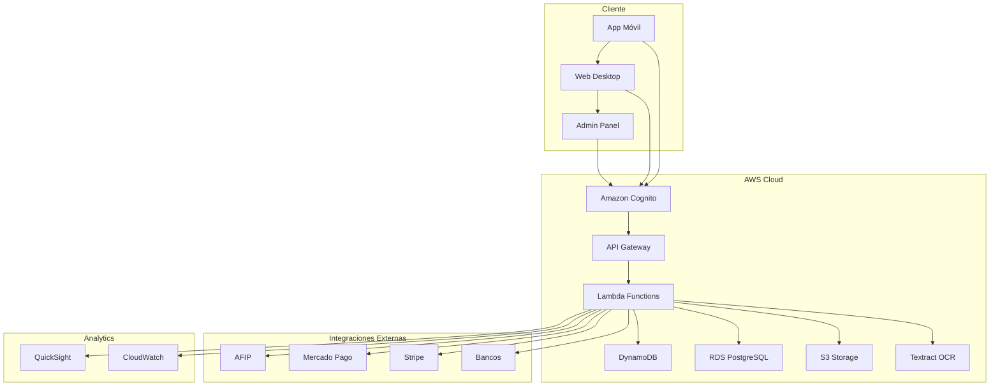

## 2. Flujo de Facturación Electrónica

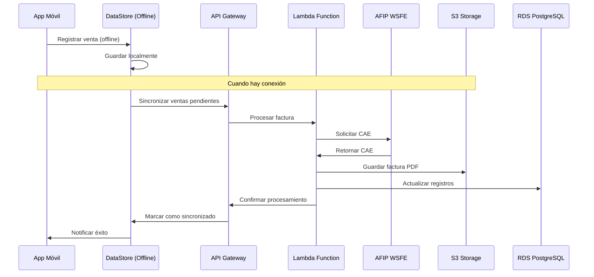

## 3. Flujo de Gestión de Stock

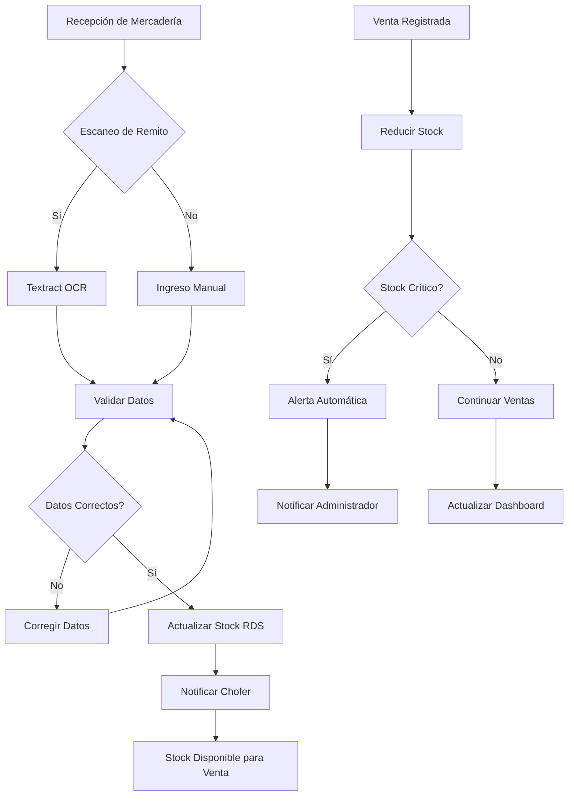

## 4. Flujo de Sincronización Offline

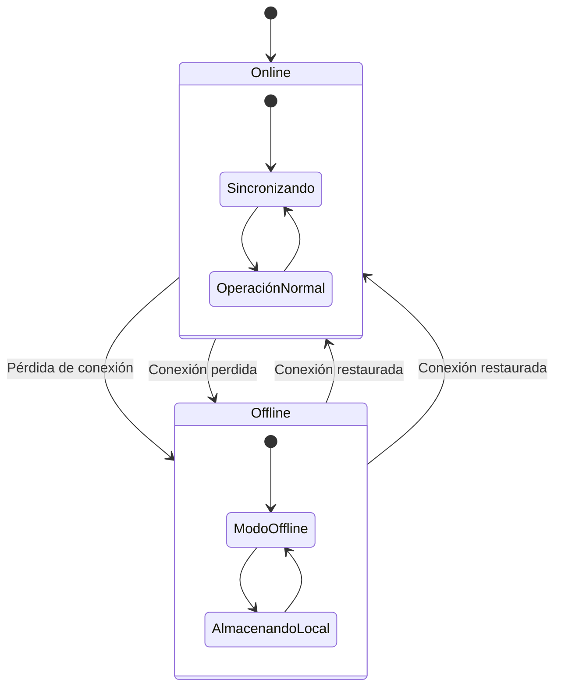

## 5. Flujo de Procesamiento de Pagos

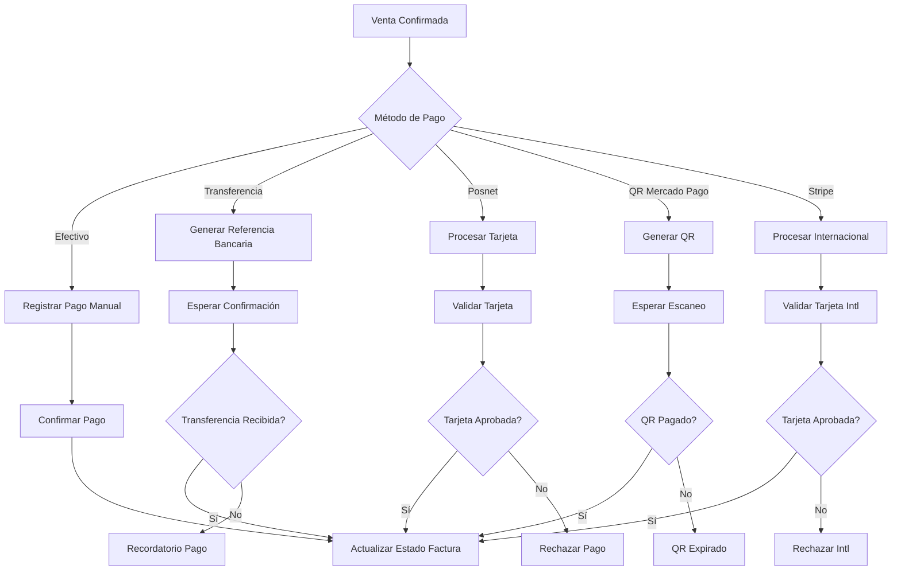

## 6. Flujo de Reportes y Analytics

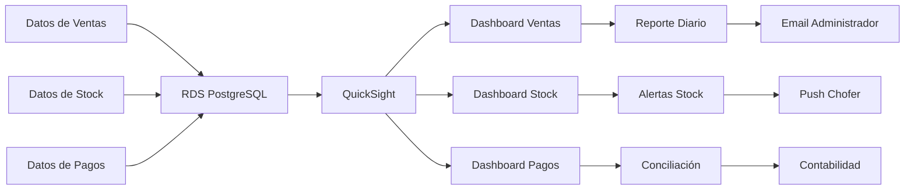

## 7. Flujo de Gestión de Usuarios y Permisos

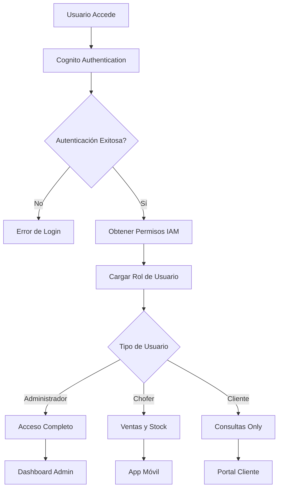

## 8. Flujo de Backup y Recuperación

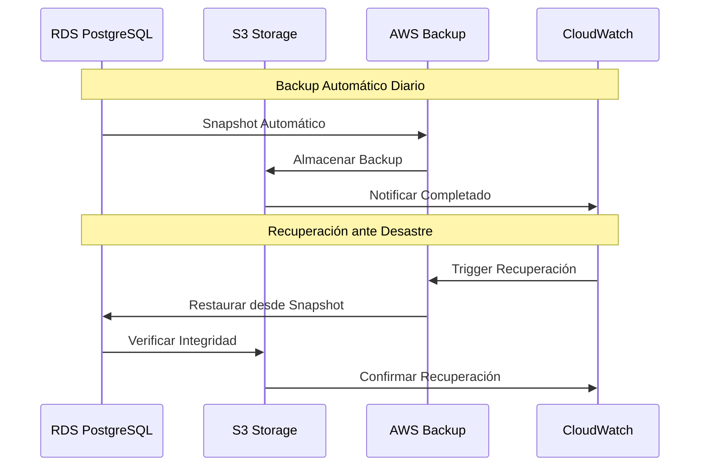

## 9. Flujo de Monitoreo y Alertas

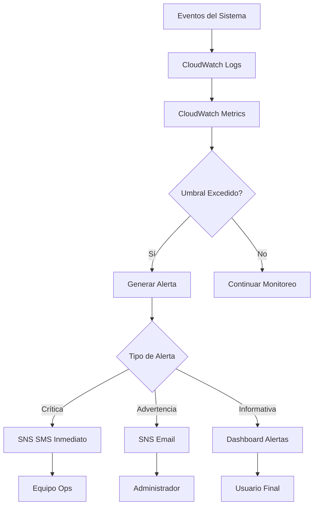

## 10. Flujo de Despliegue CI/CD

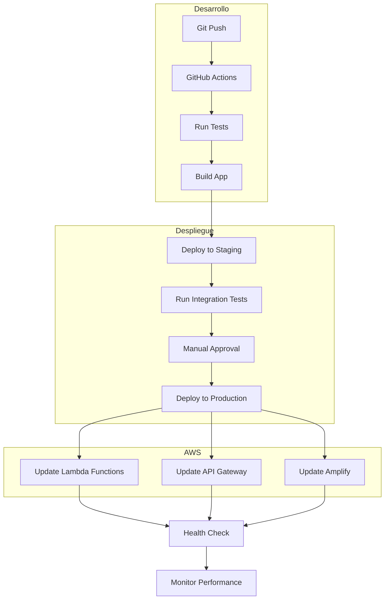

## 11. Flujo de Escalado Automático

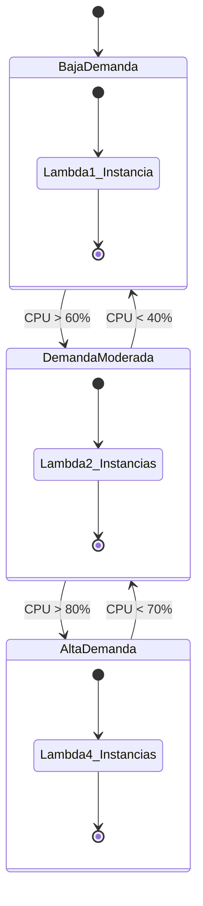

## 12. Flujo de Auditoría y Cumplimiento

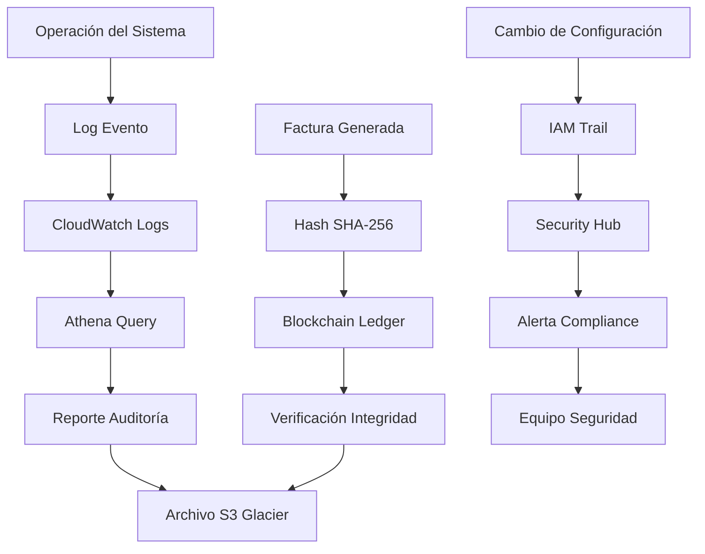

## 13. Flujo de Integración AFIP

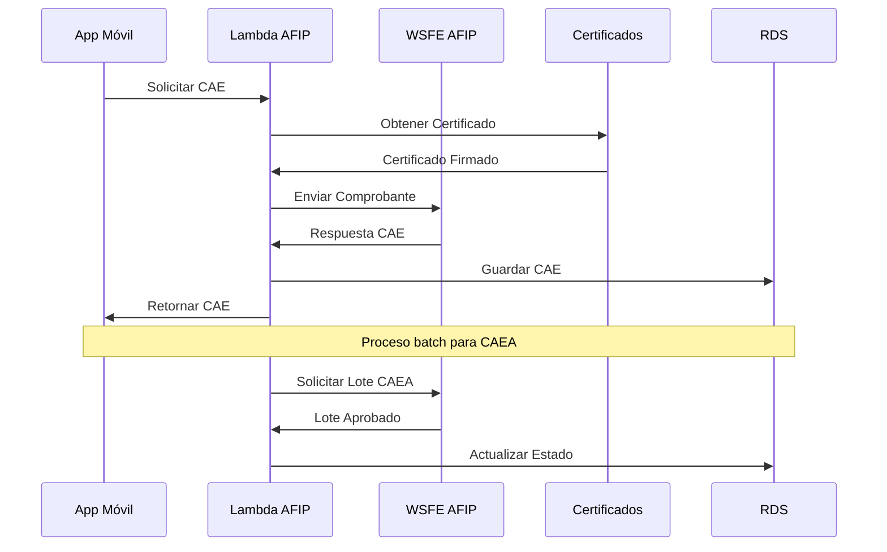

## 14. Flujo de Gestión de Errores

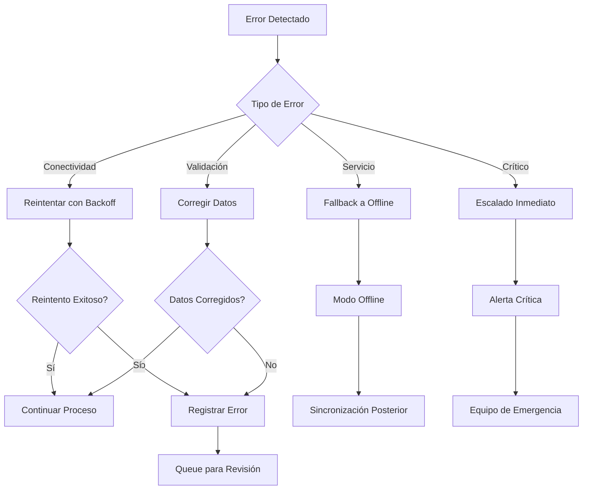
